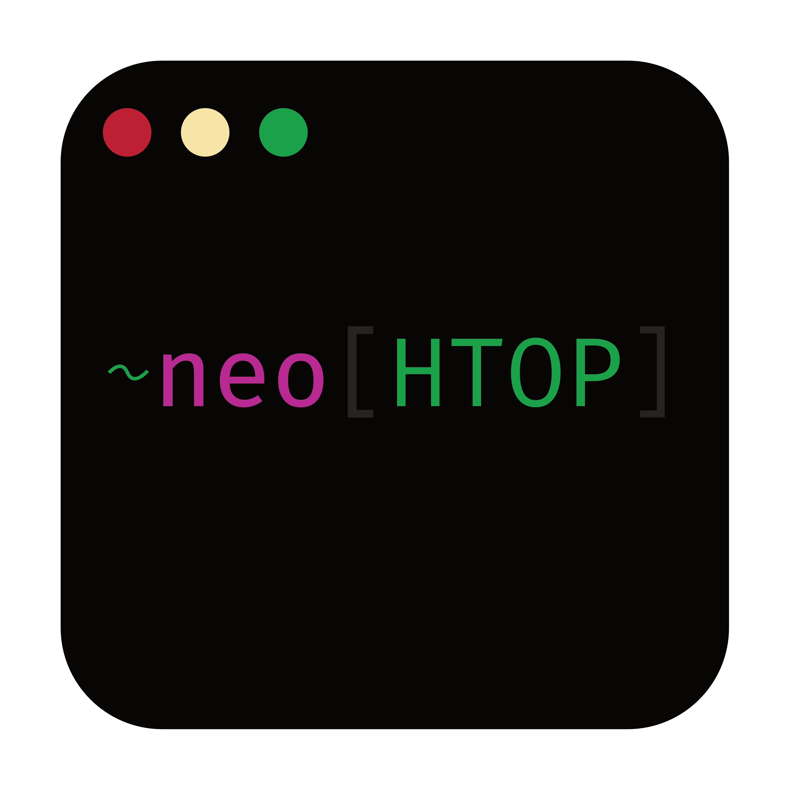

<div align="center">
  
  <h1>NeoHtop</h1>
  <p>A modern, cross-platform system monitor built on top of Svelte, Rust, and Tauri.</p>

  [](https://github.com/Abdenasser/neohtop/blob/main/LICENSE)
  [](https://github.com/Abdenasser/neohtop/stargazers)
  [](https://github.com/Abdenasser/neohtop/issues)
  [](https://github.com/Abdenasser/neohtop/releases)
  [](https://developer.apple.com/documentation/security/notarizing-macos-software-before-distribution)
</div>

<div align="center">
  
</div>

## [Why another system monitor? That's not a TUI? (The Back Story)](https://www.abdenasser.com/2024/11/06/oh-boy-neohtop/)

## Features

- 🚀 Real-time process monitoring
- 💻 CPU and Memory usage tracking
- 🎨 Beautiful, modern UI with dark/light themes
- 🔍 Process search and filtering

  Search for processes by name, command, or PID. Search for multiple things at once by separating them with commas. For
  example, `arm, x86` will return processes having `arm` or `x86` as a substring of the name or command. You can use
  regular expressions too. For example, `d$` will return a list of daemons (which tend to end in the letter `d`), while
  `^(\w+\.)+\w+$` will return a list of processes with reverse domain name notation, such as `com.docker.vmnetd`.

- 📌 Pin important processes
- 🛠 Process management (kill processes)
- 🎯 Sort by any column
- 🔄 Auto-refresh system stats

## Tech Stack

- **Frontend**: SvelteKit, TypeScript
- **Backend**: Rust, Tauri
- **Styling**: CSS Variables for theming
- **Icons**: FontAwesome

## Development

### Prerequisites

- Node.js (v16 or later)
- Rust (latest stable)
- Xcode Command Line Tools (for macOS)

### Setup

```bash
# Install dependencies
npm install

# Run in development mode
npm run tauri dev

# Build for production
npm run tauri build

# Build for local mac(Bypass code signing)
npm run tauri build -- --bundles app --config "{\"bundle\":{\"macOS\":{\"signingIdentity\":null}}}"
```

### Development Setup

The project uses pre-commit hooks to ensure code consistency. After cloning and installing dependencies, the pre-commit hooks will be automatically installed.

#### Code Formatting

We use Prettier for web code and `cargo fmt` for Rust code. Format your code using:

```bash
# Format all files
npm run format

# Check formatting without making changes
npm run format:check
```

The pre-commit hook will automatically format your code when you commit, but you can run the formatter manually at any time.

#### Pull Requests

Before submitting a PR, please ensure:
1. All code is formatted (`npm run format`)
2. The format check passes (`npm run format:check`)
3. Your commits follow the project's commit message conventions

## Contributing

We welcome contributions from the community! Please see our [contributing guidelines](./.github/CONTRIBUTING.md) for more information.

## Support

If you find this project helpful, consider buying me a coffee:

<a href="https://www.buymeacoffee.com/abdenasser" target="_blank"></a>

## License

This project is licensed under the MIT License - see the [LICENSE](LICENSE) file for details.
